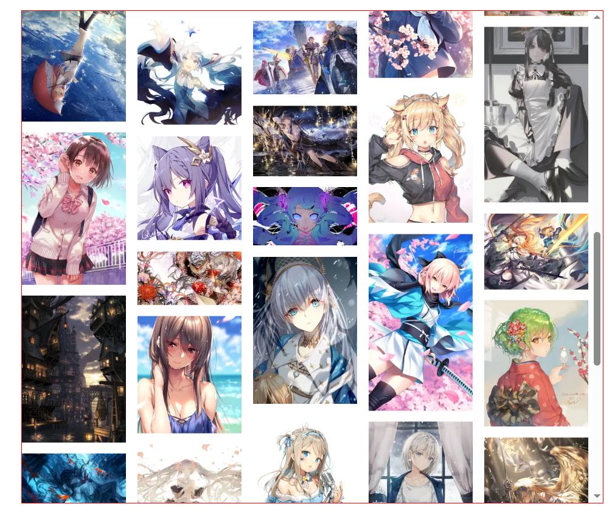

# 瀑布流虚拟列表组件

react + ts 简易封装**定高瀑布流虚拟列表**组件

**未实现响应式、不定高、优化等效果**，仅提供使用 react 技术栈的简易实现思路

具体实现的完整版请参照之前的 Vue3 版实现：

[DrssXpro/virtualwaterfall-demo: Vue3+TS：实现小红书瀑布流虚拟列表组件 (github.com)](https://github.com/DrssXpro/virtualwaterfall-demo)

图片数据来源：vilipix（且用且珍惜）

效果如下 👇（gif 图片过大就不放了，只放截图）：

